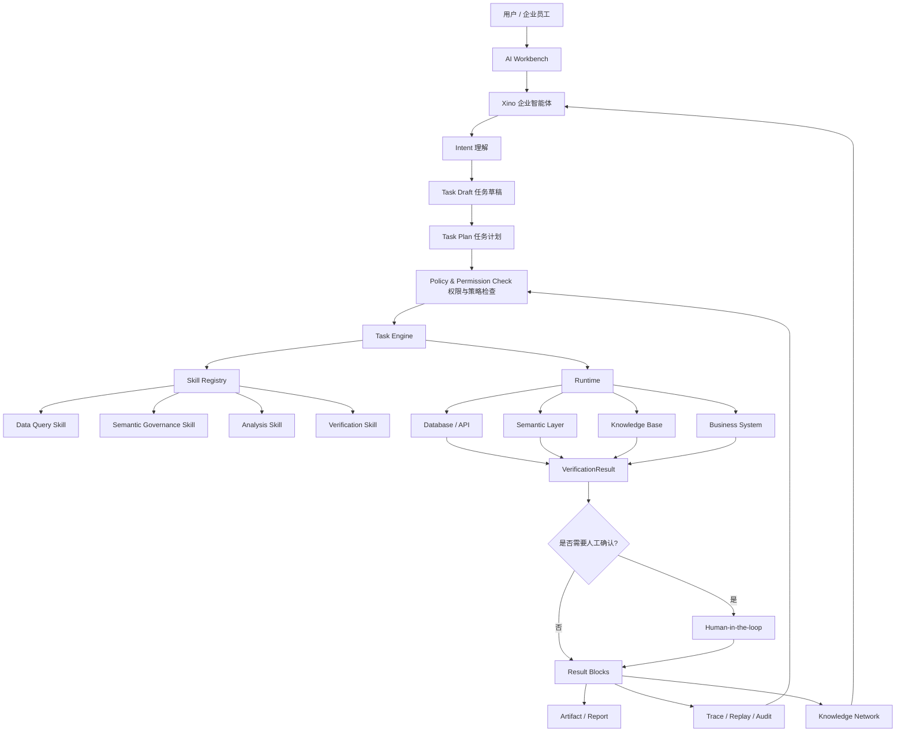

# 国家发文支持智能体：企业级 AI Agent 的机会来了

> 状态：本文为正式初稿，可作为公众号文章、GitHub 文档、Semovix 技术内容体系的第一篇基础文章。  
> 本文结合国家政策解读、AI Agent 开发知识体系，以及 Semovix / Xino 的产品定位与能力规划，回答一个核心问题：**企业真正需要的 AI Agent，到底应该是什么样子？**

---

## 1. 这篇文章解决什么问题

2026 年 5 月，国家网信办、国家发展改革委、工业和信息化部联合印发《智能体规范应用与创新发展实施意见》。这份文件明确提出，智能体是具备**自主感知、记忆、决策、交互与执行能力**的智能系统，是人工智能产品及服务的重要形态。

这意味着，AI Agent 不再只是技术圈里的热门概念，而是正式进入国家层面的规范应用与创新发展框架。

但是，很多企业在理解 AI Agent 时仍然存在几个常见误区：

- 把 Agent 等同于聊天机器人；
- 把 Agent 等同于大模型加工具调用；
- 把 Agent 等同于自动化脚本；
- 只关注模型能力，不关注权限、审计、验证和治理；
- 只看演示效果，不看企业场景能否安全落地。

这篇文章要解决的，就是把“智能体”这件事讲清楚：

1. **国家如何定义智能体？**  
2. **AI Agent 在完整开发知识体系中处于什么位置？**  
3. **为什么企业需要的是可控智能体，而不是简单聊天 AI？**  
4. **Semovix / Xino 如何对齐企业级智能体的能力要求？**  
5. **在找数问数、语义治理、AI 工作台等场景中，智能体如何形成业务闭环？**

对于 Semovix 来说，这篇文章也是整个 AI Agent 技术内容系列的入口文章。它要回答的是：

> Semovix 不是简单做一个 AI 聊天入口，而是在构建一个面向企业场景的可控智能体能力底座。

---

## 2. 核心结论

### 结论一：国家定义的智能体，不是聊天机器人

《智能体规范应用与创新发展实施意见》明确提出，智能体具备自主感知、记忆、决策、交互与执行能力。

这说明，智能体的核心不是“会不会回答”，而是能否围绕任务形成完整闭环：

```text
理解环境 → 记住上下文 → 判断下一步 → 与人和系统交互 → 调用工具完成动作
```

### 结论二：企业级 Agent 的重点，不是自由发挥，而是受控执行

在个人场景里，Agent 可以强调自动化、探索性和体验感。  
但在企业场景里，Agent 必须强调：

- 权限边界；
- 数据安全；
- 执行确认；
- 过程透明；
- 结果验证；
- 审计追溯；
- 风险恢复。

企业不会把核心业务流程交给一个不可预测、不可追责的黑箱系统。

### 结论三：AI Agent 的工程体系，必须覆盖模型、上下文、工具、工作流、运行时、评测和治理

一个真正可落地的 Agent 系统，不能只靠 LLM 本身。它至少需要：

- LLM 基础能力；
- Prompt 与 Context 管理；
- RAG 与知识检索；
- Memory 与状态管理；
- Planning 与 Task Decomposition；
- Tool / Skill 调用；
- Workflow 编排；
- Runtime 执行环境；
- Evaluation 评测；
- Governance 治理；
- Human-in-the-loop 人机协同。

### 结论四：Semovix 的产品机会，是企业数据、知识与行动的连接

Semovix 的核心价值不应该只是“让 AI 回答问题”，而是：

> 让企业的数据、知识、工具和业务流程被智能体安全、可信、可追溯地连接起来。

这正好对应 Semovix 的品牌定位：

```text
Semovix｜面向企业场景的可控智能体能力底座
```

### 结论五：未来 Agent 的竞争，是治理能力与落地能力的竞争

下一阶段，企业级 AI Agent 的关键竞争点不只是模型性能，而是：

- 能不能接入企业真实数据；
- 能不能理解业务语义；
- 能不能调用工具完成任务；
- 能不能保证权限合规；
- 能不能验证结果；
- 能不能回放全过程；
- 能不能沉淀为组织知识。

---

## 3. 核心概念

## 3.1 什么是 AI Agent

从工程视角看，AI Agent 可以理解为：

> 一个以大模型为认知核心，能够感知上下文、理解目标、规划任务、调用工具、执行动作、观察结果并持续调整的智能系统。

它不是一个单点模型，也不是一个简单函数，而是一个由多个模块组成的任务执行系统。

一个典型 Agent 至少包含：

| 模块 | 作用 |
|---|---|
| Model | 负责理解、推理、生成和决策 |
| Context | 管理上下文、约束、历史和环境信息 |
| Memory | 保留短期状态和长期经验 |
| Planner | 拆解任务、生成计划 |
| Tool / Skill | 调用外部能力完成动作 |
| Runtime | 负责执行、调度、隔离和恢复 |
| Evaluator | 判断结果是否正确、可信、合规 |
| Governance | 管理权限、审计、安全和风险 |
| Human-in-the-loop | 在关键节点引入人工确认和协作 |

## 3.2 国家定义中的五种能力

政策文件将智能体定义为具备以下五种能力的智能系统：

| 国家定义 | 工程解释 | Semovix 对应能力 |
|---|---|---|
| 自主感知 | 理解环境、上下文、数据输入和任务目标 | Workbench 输入、上下文理解、数据接入 |
| 记忆 | 保留历史信息、任务状态和业务经验 | 会话历史、任务状态、Knowledge Network |
| 决策 | 判断下一步该做什么 | Intent 理解、任务拆解、执行规划 |
| 交互 | 与人、系统、工具、数据源协同 | AI Workbench、人机协同确认 |
| 执行 | 调用工具、推进流程、生成结果 | Skills / Tools / Task Engine / Runtime |

## 3.3 Agent 与普通聊天机器人的区别

| 对比项 | 普通聊天机器人 | AI Agent |
|---|---|---|
| 目标 | 回答用户问题 | 完成用户任务 |
| 输入 | 用户自然语言 | 用户目标 + 上下文 + 数据 + 工具环境 |
| 输出 | 文本回答 | 任务计划、工具调用、结果产物、执行记录 |
| 能力 | 对话生成 | 感知、记忆、规划、执行、验证 |
| 风险 | 主要是回答错误 | 可能产生业务影响和执行风险 |
| 企业要求 | 内容质量 | 权限、审计、验证、回放、治理 |

一句话概括：

> 聊天机器人解决“怎么说”，Agent 解决“怎么做”。

## 3.4 Agent 与 RAG 的区别

RAG 主要解决“从哪里找知识、如何增强回答”的问题。  
Agent 解决的是“如何基于目标完成任务”的问题。

RAG 可以是 Agent 的一个组件，但不能等同于 Agent。

```text
RAG：检索知识 → 生成回答
Agent：理解目标 → 制定计划 → 检索知识 → 调用工具 → 执行动作 → 验证结果
```

## 3.5 Agent 与 Workflow 的区别

Workflow 是流程编排，强调流程确定性。  
Agent 是智能决策系统，强调目标驱动和动态适应。

在企业场景中，最可靠的方式往往不是让 Agent 完全自由行动，而是：

```text
Agent 负责理解和决策
Workflow 负责约束和执行路径
Human-in-the-loop 负责关键节点确认
Governance 负责安全与审计
```

这也是 Semovix 应该坚持的方向：

> 不是让智能体失控地自动运行，而是在可治理的流程中释放智能体能力。

---

## 4. 为什么传统方式不够

## 4.1 传统 BI / 数据平台不够

传统 BI、报表和数据平台可以解决“看数据”的问题，但通常无法很好解决：

- 用户不知道该查哪个指标；
- 指标口径不统一；
- 数据资产难以理解；
- 业务问题无法自动转化为数据任务；
- 查询结果无法进一步形成解释、建议和行动；
- 数据分析过程难以沉淀为可复用知识。

因此，传统数据平台更多是“工具型系统”，而不是“任务型智能体”。

## 4.2 普通 AI 问答不够

普通 AI 问答可以提升信息获取效率，但它通常停留在：

```text
用户提问 → 模型回答
```

它的问题是：

- 不知道企业内部真实数据；
- 不理解业务语义和指标口径；
- 不知道是否有权限访问数据；
- 不会自动拆解任务；
- 不会调用系统完成动作；
- 结果无法审计和回放。

对于企业来说，这类 AI 最多是“辅助解释工具”，还不能成为“执行系统”。

## 4.3 简单工具调用不够

一些 Agent Demo 会展示模型调用工具，例如查天气、搜网页、执行代码。  
但企业场景中的工具调用更复杂：

- 工具是否有权限？
- 参数是否正确？
- 数据是否脱敏？
- 操作是否高风险？
- 是否需要人工确认？
- 执行失败如何恢复？
- 结果如何验证？
- 调用记录如何审计？

所以，企业级 Agent 不能只有 Tool Calling，还需要 Tool Governance。

## 4.4 单次对话不够

企业任务通常不是一次对话就结束，而是包含：

- 需求澄清；
- 意图识别；
- 任务草稿；
- 计划确认；
- 分步执行；
- 结果检查；
- 异常修复；
- 产物沉淀；
- 后续复用。

这要求 Agent 具备任务生命周期管理能力，而不是简单的一问一答。

## 4.5 只追求自动化不够

在企业核心流程中，越自动，越需要治理。

如果一个 Agent 可以访问数据、修改配置、生成指标、发布资产、触发审批或调用外部系统，那么它必须具备：

- 最小权限；
- 明确授权；
- 高风险动作确认；
- 操作日志；
- 回滚方案；
- 合规检查；
- 责任边界。

因此，企业级 Agent 的正确方向不是“全自动”，而是“可控自动化”。

---

## 5. Agent 工程化视角

如果把 AI Agent 做成真正可落地的工程系统，需要从以下几个层次理解。

## 5.1 LLM：认知与推理核心

LLM 是 Agent 的认知核心，负责：

- 语言理解；
- 意图识别；
- 任务推理；
- 计划生成；
- 内容生成；
- 工具选择；
- 结果解释。

但是，LLM 本身不是完整 Agent。没有上下文、工具、执行环境和治理能力，LLM 只能回答，不能可靠地完成任务。

## 5.2 Context：上下文工程

Context 决定 Agent 看到什么、知道什么、遵守什么约束。

企业场景中的 Context 至少包括：

- 用户身份；
- 角色权限；
- 当前任务；
- 会话历史；
- 数据源范围；
- 业务规则；
- 指标口径；
- 安全策略；
- 输出格式；
- 风险等级。

Context 工程决定了 Agent 是否能理解业务场景。

## 5.3 RAG：知识与数据增强

RAG 负责把企业知识和数据资产引入模型上下文，常用于：

- 文档问答；
- 指标解释；
- 政策查询；
- 知识库检索；
- 数据资产说明；
- 语义层增强。

在 Semovix 中，RAG 不应该只是文档检索，而应该与 Semantic Layer 和 Knowledge Network 结合，形成面向企业语义资产的知识增强能力。

## 5.4 Memory：记忆与状态

Memory 解决 Agent 是否能够持续理解任务的问题。

企业 Agent 至少需要两类记忆：

| 类型 | 说明 |
|---|---|
| 短期记忆 | 当前会话、当前任务、当前步骤状态 |
| 长期记忆 | 用户偏好、业务规则、历史经验、知识资产 |

没有 Memory，Agent 就无法形成连续任务能力。

## 5.5 Planning：任务规划

Planning 是 Agent 从“理解问题”走向“执行任务”的关键。

一个好的 Planning 至少要回答：

- 用户到底想完成什么？
- 这个任务属于什么类型？
- 是否需要澄清？
- 需要哪些数据和工具？
- 分成哪些步骤执行？
- 哪些步骤需要人工确认？
- 如何判断执行成功？

Semovix 中的 Intent、Task Draft、Task Plan、Task Engine 都属于这个层次。

## 5.6 Tool：工具调用

Tool 是 Agent 与外部世界发生作用的方式。

常见 Tool 包括：

- 数据库查询；
- API 调用；
- 文件解析；
- 搜索检索；
- 代码执行；
- 工作流触发；
- 系统配置修改；
- 消息发送；
- 任务创建。

企业 Agent 的 Tool 必须具备明确的输入输出契约和权限范围。

## 5.7 Skill：能力单元

Skill 可以理解为比 Tool 更高层的能力封装。

一个 Skill 不只是一个函数，而应该包含：

- 能力说明；
- 输入输出 Schema；
- 适用场景；
- 权限范围；
- 风险等级；
- 执行步骤；
- 验证规则；
- 示例任务；
- 失败恢复策略；
- 审计要求。

对于 Semovix 来说，Skill 是企业智能体能力资产化的关键。

## 5.8 Workflow：流程约束

Workflow 提供可控路径，避免 Agent 完全自由执行。

典型企业任务可以采用：

```text
Agent 生成计划 → Workflow 固化执行路径 → Tool 执行动作 → Verification 校验结果 → Human 确认高风险步骤
```

这种方式比纯 Agent 自主执行更适合企业核心场景。

## 5.9 Runtime：运行环境

Runtime 负责智能体的执行调度和安全隔离。

它需要支持：

- 任务状态管理；
- 工具调用调度；
- 超时控制；
- 错误重试；
- 沙箱隔离；
- 日志记录；
- 结果回传；
- 异常恢复。

Runtime 是 Agent 从 Demo 走向生产系统的关键。

## 5.10 Evaluation：评测与验证

Agent 的结果不能只看“像不像正确”，而要验证：

- 数据是否准确；
- 工具是否调用正确；
- 输出是否符合格式；
- 业务规则是否满足；
- 是否存在幻觉；
- 是否越权；
- 是否需要人工复核。

Semovix 中的 VerificationResult / Review / Result Check 应该成为核心能力。

## 5.11 Governance：治理与安全

治理是企业级 Agent 的底座能力。

它包括：

- 身份认证；
- 权限控制；
- 数据脱敏；
- 行为围栏；
- 风险分级；
- 审计日志；
- 合规检查；
- 异常阻断；
- 回放复盘。

政策文件明确强调安全可控、规范有序、分类分级治理、行为可验证和可追溯。企业级 Agent 必须把这些能力内建到产品架构中。

## 5.12 Human-in-the-loop：人机协同

企业 Agent 不应该试图替代所有人类决策。

更合理的方式是：

| 场景 | Agent 作用 | 人的作用 |
|---|---|---|
| 低风险任务 | 自动执行 | 事后查看 |
| 中风险任务 | 生成方案并执行部分步骤 | 确认关键节点 |
| 高风险任务 | 提供建议和草稿 | 人工审批后执行 |
| 敏感任务 | 辅助分析 | 人类最终决策 |

这也是政策强调用户知情权和最终决策权的原因。

---

## 6. Semovix 中如何落地

## 6.1 Semovix 的品牌定位

Semovix 可以定义为：

> 面向企业场景的数据语义治理与可控智能体执行平台。

更简洁的品牌表达是：

```text
Semovix｜连接数据、知识与行动的企业智能体平台
```

或：

```text
Semovix｜面向企业场景的可控智能体能力底座
```

这两个表达的重点不同：

| 表达 | 重点 |
|---|---|
| 连接数据、知识与行动 | 更适合对外品牌传播 |
| 可控智能体能力底座 | 更适合技术白皮书、政策解读、企业客户 |

## 6.2 Xino 的角色定位

Xino 不应该只是一个聊天助手，而应该是 Semovix 中的企业智能体入口。

它的角色可以定义为：

> Xino 是面向企业场景的可控执行智能体，负责理解用户任务、生成任务草稿、协调 Skills / Tools、推进执行流程、验证结果并沉淀知识。

Xino 的价值不是“替用户随便做决定”，而是：

- 帮用户理解复杂任务；
- 帮用户拆解执行步骤；
- 帮用户调用合适能力；
- 在关键节点等待确认；
- 把过程和结果留痕；
- 把经验沉淀为组织知识。

## 6.3 AI Workbench：人机协同任务控制台

AI Workbench 是用户与智能体协同工作的主界面。

它应该承担：

- 接收用户自然语言输入；
- 展示意图理解结果；
- 生成任务草稿；
- 展示任务计划；
- 展示执行过程；
- 展示结果块；
- 支持人工确认；
- 支持回放和审计。

AI Workbench 的核心不是“聊天界面”，而是“任务控制台”。

## 6.4 Intent：从用户表达走向任务类型

Intent 是 Semovix 的第一道智能理解能力。

它需要判断用户输入属于哪类任务，例如：

- 找数问数；
- 指标解释；
- 数据资产查询；
- 语义治理；
- 血缘分析；
- 质量检查；
- 任务创建；
- Skill 使用；
- 文档生成；
- 审批确认。

Intent 分类越准确，后续任务规划和执行越可靠。

## 6.5 Task Engine：任务执行核心

Task Engine 负责把任务从“计划”推进到“执行”。

它需要管理：

- 任务状态；
- 执行步骤；
- Skill 调用；
- Tool 调用；
- 中间结果；
- 失败重试；
- 人工确认；
- 最终产物。

Task Engine 是 Semovix 从 AI 问答走向智能执行的关键模块。

## 6.6 Skill Registry：能力资产管理

Skill Registry 是企业智能体能力资产化的核心。

每个 Skill 都应该被注册、描述、测试、授权和审计。

建议 Skill 元数据至少包括：

| 字段 | 说明 |
|---|---|
| skill_id | 能力唯一标识 |
| display_name | 展示名称 |
| description | 能力说明 |
| input_schema | 输入契约 |
| output_schema | 输出契约 |
| permission_scope | 权限范围 |
| risk_level | 风险等级 |
| human_confirm_required | 是否需要人工确认 |
| verification_rules | 验证规则 |
| audit_enabled | 是否开启审计 |
| version | 版本 |
| owner | 负责人 |

这样 Skill 才不是简单插件，而是可治理的企业能力资产。

## 6.7 Semantic Layer：语义层

Semantic Layer 是 Semovix 区别于普通 Agent 平台的关键。

它负责把企业数据变成智能体可理解的语义资产，包括：

- 指标；
- 维度；
- 实体；
- 口径；
- 规则；
- 标签；
- 数据表；
- 血缘关系；
- 数据质量；
- 业务术语。

没有语义层，Agent 很难真正理解企业数据。

## 6.8 Knowledge Network：知识沉淀

Knowledge Network 负责把每次任务执行沉淀为组织知识。

它可以沉淀：

- 常见问题；
- 指标解释；
- 查询路径；
- 业务规则；
- 治理建议；
- 任务模板；
- Skill 使用经验；
- 异常处理经验。

这是 Semovix 从“一次性问答”走向“组织能力进化”的关键。

## 6.9 Trace / Replay / Audit：过程可信

企业级 Agent 必须支持全过程留痕。

Semovix 中至少需要记录：

- 用户原始输入；
- Intent 识别结果；
- Task Draft；
- Task Plan；
- 每一步 Skill / Tool 调用；
- 输入参数；
- 返回结果；
- 模型判断摘要；
- 人工确认记录；
- VerificationResult；
- Artifact；
- 异常与恢复路径。

这使得 Semovix 不只是“能执行”，而是“执行过程可信”。

---

## 7. 一个具体案例

下面以“找数问数 + 语义治理”场景为例，说明 Semovix 中的企业级智能体如何工作。

## 7.1 用户输入

用户在 AI Workbench 中输入：

```text
帮我看一下华东区域上个月销售额为什么下降，并检查相关指标口径是否一致。
```

这句话表面上是一个数据分析问题，但实际包含多个任务：

- 找数问数；
- 指标查询；
- 区域过滤；
- 时间过滤；
- 异常归因；
- 指标口径检查；
- 语义治理建议。

## 7.2 Intent 理解

Xino 识别出该请求涉及两个主任务：

| 任务 | 类型 |
|---|---|
| 华东区域上月销售额下降分析 | Find Data / Data Analysis |
| 销售额指标口径一致性检查 | Semantic Governance |

同时判断该任务需要访问数据源和指标语义层，因此需要检查用户权限。

## 7.3 生成任务草稿

Xino 生成任务草稿：

```text
任务目标：分析华东区域上月销售额下降原因，并检查销售额指标口径一致性。

执行步骤：
1. 查询销售额指标定义；
2. 检查用户是否有访问华东区域销售数据权限；
3. 查询上月与前期销售额对比数据；
4. 按产品、渠道、客户、门店等维度拆解变化；
5. 检查销售额指标在不同报表和数据资产中的口径差异；
6. 输出下降原因分析和语义治理建议。
```

## 7.4 Task Engine 执行

Task Engine 按步骤调用能力：

| 步骤 | 调用能力 |
|---|---|
| 查询指标定义 | Semantic Layer Search Skill |
| 权限检查 | Permission Check Tool |
| 查询数据 | Data Query Skill |
| 归因分析 | Analysis Skill |
| 口径检查 | Metric Consistency Skill |
| 生成建议 | Governance Recommendation Skill |

## 7.5 人工确认

如果系统发现某些操作可能影响企业资产，例如“自动修改指标口径”或“发布治理规则”，则不会直接执行，而是进入人工确认：

```text
Xino 建议：销售额指标存在两个不同口径，是否创建治理任务进行合并？

可选操作：
- 仅查看建议；
- 创建治理任务；
- 指派数据负责人；
- 暂不处理。
```

## 7.6 VerificationResult

系统对结果进行验证：

- 查询 SQL 是否符合权限范围；
- 指标口径是否来自可信语义层；
- 数据结果是否有来源；
- 异常分析是否有数据支撑；
- 治理建议是否可执行；
- 是否存在高风险动作。

## 7.7 最终输出

最终输出不只是一段回答，而是多个结构化结果块：

| 结果块 | 内容 |
|---|---|
| 数据结论 | 华东区域销售额下降幅度、主要影响维度 |
| 归因分析 | 产品、渠道、客户、区域拆解 |
| 指标口径检查 | 不同资产中的销售额定义差异 |
| 治理建议 | 建议统一口径、创建治理任务 |
| 执行记录 | 查询、分析、验证全过程 |
| 可回放链接 | 查看任务执行链路 |

这就是 Semovix 中“找数问数 + 语义治理 + 智能体执行”的业务闭环。

---

## 8. 架构图 / 流程图

## 8.1 Mermaid 源码



## 8.2 企业级智能体运行与治理架构图


---

## 9. 常见误区

## 误区一：Agent 就是聊天机器人

错误。聊天机器人主要负责回答问题，Agent 需要完成任务。  
二者最大的区别是：Agent 必须具备规划、工具调用、执行和反馈能力。

## 误区二：有了大模型就有了 Agent

错误。大模型只是 Agent 的认知核心。  
完整 Agent 还需要 Context、Memory、Planning、Tool、Workflow、Runtime、Evaluation 和 Governance。

## 误区三：Agent 越自动越好

不一定。企业场景中，越靠近核心业务，越需要控制。  
真正可用的企业 Agent，不是完全自动，而是在授权边界内自动。

## 误区四：Agent 只适合个人效率工具

错误。政策文件已经明确提出，智能体将在科研、产业、消费、民生、社会治理等多个场景中落地。企业级 Agent 是未来的重要方向。

## 误区五：Semovix 只需要做一个 AI 问答入口

错误。Semovix 的核心机会不是普通 AI 问答，而是企业级智能体底座：

```text
数据语义治理 + 任务执行 + Skill 能力管理 + 过程验证 + 审计回放 + 知识沉淀
```

## 误区六：Skill 就是插件

不完整。企业级 Skill 不应该只是插件，而应该是可注册、可授权、可测试、可审计、可治理的能力资产。

---

## 10. 本篇总结

《智能体规范应用与创新发展实施意见》释放了一个明确的信号：智能体正在从技术概念走向规范化、场景化、平台化和产业化。

但对企业来说，真正重要的问题不是“有没有 Agent”，而是：

- Agent 是否理解企业业务？
- Agent 是否能接入企业数据？
- Agent 是否能调用工具完成任务？
- Agent 是否有权限边界？
- Agent 是否能验证结果？
- Agent 是否能回放过程？
- Agent 是否能沉淀知识？

这也是 Semovix / Xino 需要持续建设的方向。

一句话概括：

> 企业级智能体的核心，不是让 AI 更像人，而是让 AI 在企业场景中更可信、更可控、更可追溯。

因此，Semovix 的长期价值不只是提供 AI 交互体验，而是构建一个连接数据、知识与行动的企业智能体平台。

---

## 11. 下一篇预告

下一篇建议进入 AI Agent 开发知识体系的基础层：

# 下一篇：LLM 基础：AI Agent 的认知核心从哪里来？

建议重点回答：

- LLM 在 Agent 系统中承担什么角色；
- Token、Embedding、Prompt、Context Window 分别是什么；
- 为什么只懂 Prompt 不够，还要理解上下文工程；
- LLM 的幻觉、边界和不确定性如何影响 Agent；
- Semovix / Xino 如何把 LLM 能力放入可控的企业任务系统中。

后续系列可以按以下顺序展开：

1. LLM 基础：Agent 的认知核心；
2. Prompt 与 Context：Agent 如何理解任务；
3. RAG 与 Knowledge：Agent 如何接入企业知识；
4. Memory：Agent 如何形成连续任务能力；
5. Planning：Agent 如何拆解复杂任务；
6. Tool / Skill：Agent 如何连接外部系统；
7. Workflow / Runtime：Agent 如何稳定执行；
8. Evaluation：Agent 结果如何验证；
9. Governance：企业级 Agent 如何安全可控；
10. Semovix 实战：找数问数与语义治理智能体闭环。

---

## 12. 参考资料

1. 国家互联网信息办公室：《智能体规范应用与创新发展实施意见》，2026-05-08。  
   https://www.cac.gov.cn/2026-05/08/c_1779979789523320.htm

2. 国家互联网信息办公室：《国家网信办、国家发展改革委、工业和信息化部联合印发〈智能体规范应用与创新发展实施意见〉》，2026-05-08。  
   https://www.cac.gov.cn/2026-05/08/c_1779979789472520.htm

3. Semovix / Xino 内部产品规划：AI Workbench、Intent、Task Engine、Skill Registry、Semantic Layer、Knowledge Network、Trace / Replay / Audit。

4. AI Agent 开发知识体系规划：LLM、Prompt、Context、RAG、Memory、Planning、Tool、Skill、Workflow、Runtime、Evaluation、Governance、Human-in-the-loop。

> 建议将关键来源同步维护到根目录 `REFERENCES.md`。
