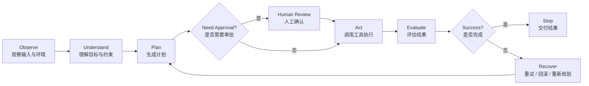

# Agent 受控闭环

## 1. 图的用途

用于解释生产级 Agent 的 Observe、Plan、Act、Evaluate、Recover、Stop。

## 2. 推荐比例

16:9 或 21:9。

## 3. 适合放在哪些文章

- 待补充。

## 4. 图中必须包含的模块

- 用户 / 输入；
- Xino / Agent；
- Context；
- Tool / Skill；
- Task / Workflow；
- Runtime / Harness；
- Result / Artifact；
- Trace / Replay / Audit；
- Knowledge Network。

## 5. Mermaid 草稿





## 6. 图片生成 Prompt 草稿

```text
请生成一张高信息密度、百科全书式、教材讲义式的信息图。
主题：Agent 受控闭环
风格：专业技术白皮书、结构化知识树、扁平化图标、中文清晰、适合打印与学习。
要求：层次清晰、模块边界明确、箭头逻辑清楚、字体清晰、小字可读。
比例：16:9 或 21:9。
```

## 7. 版本记录

| 版本 | 日期 | 说明 |
|---|---|---|
| v0.1 | 2026-05-12 | 初始化占位稿 |
