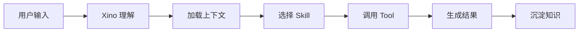

# 文章标题

> 建议标题格式：
>
> - 问题型：`AI Agent 到底是什么？`
> - 工程型：`Agent Harness：让 Agent 稳定运行的控制系统`
> - 场景型：`找数问数 Agent：从自然语言问题到可信数据结果`

## 1. 这篇文章解决什么问题

说明读者为什么要看这篇文章。

建议回答：

- 当前行业或团队有什么误区？
- 这个问题为什么重要？
- 不解决会带来什么工程风险或产品风险？

## 2. 核心结论

用 3 到 5 条总结。

示例：

1. Agent 不是 ChatBot，而是受控任务闭环。
2. 企业级 Agent 的难点不只在 Prompt，而在 Context、Tool、State、Workflow 和 Governance。
3. Semovix 的价值在于把企业数据、业务语义和任务执行连接起来。

## 3. 核心概念

解释本篇关键词。

建议包含：

- 定义；
- 边界；
- 与相邻概念的区别；
- 常见误解。

## 4. 为什么传统方式不够

说明旧方案的问题。

可以从以下角度写：

- 普通聊天机器人；
- 单点 RAG；
- 手写固定流程；
- 纯 Prompt 驱动；
- 无状态工具调用。

## 5. Agent 工程化视角

从 Agent 系统角度重新解释。

建议映射到：

| 维度 | 本文关系 |
|---|---|
| Context | 待补充 |
| Tool | 待补充 |
| Skill | 待补充 |
| Workflow | 待补充 |
| Runtime | 待补充 |
| Evaluation | 待补充 |
| Governance | 待补充 |

## 6. Semovix 中如何落地

说明这个能力在 Semovix / Xino / AI Workbench 中的对应关系。

建议明确：

- 对应哪个产品模块；
- 对应哪个用户场景；
- 对应哪个后端能力；
- 对应哪个前端展示；
- 对应哪个可审计结果。

## 7. 一个具体案例

建议使用真实或半真实业务案例。

模板：

```text
用户输入：
系统理解：
上下文加载：
工具调用：
任务执行：
结果展示：
用户确认：
知识沉淀：
```

## 8. 架构图 / 流程图

建议放 Mermaid，也可以链接到 `09-diagrams/`。



## 9. 常见误区

建议列 3 到 5 个误区。

| 误区 | 正确认知 |
|---|---|
| 待补充 | 待补充 |

## 10. 本篇总结

用一段话收束观点。

## 11. 下一篇预告

说明下一篇将继续解决什么问题。

## 12. 参考资料

- 待补充。
